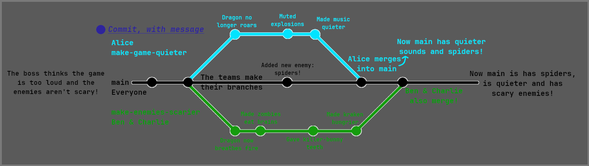

# Git

*To all the Git nerds out there, I'm going to simplify a bit.*
*I do know how it actually works. Don't shout at me.*

This guide will introduce you to the basics of Git - what it is, why you should use it, and how it works.
There'll be a little bit of technical information, but any key concepts are explained.
Keywords marked in **bold** are explained in the [Terminology](#Terminology) section.

## Contents:
- [What is Git?](#what-is-git)
- [Why does anyone use Git?](#why-does-anyone-use-git)
- [Why do I need Git if I'm working alone?](#why-do-i-need-git-if-im-working-alone)
- [But Git's annoying to use!](#but-gits-annoying-to-use)
- [How to use Git (the basics)](#how-to-use-git-the-basics)

## What is Git?
Git is a source control tool for managing and synchronising edits within a codebase.

When you use Git, there are several pieces in play:
- Git *(**git.exe** is sitting somewhere on your computer)*
- A Git client *(a way of talking to Git)*
- Whoever is hosting your **remote Git repository**
*(lots of scary words, but that's normally just GitHub)*

Confused? Here's a picture!


I bet that didn't help at all...

## Why does anyone use Git?
One of the main use cases for Git is when working in a team.
When programming professionally, you will often work in teams, which means that 
    many developers will be making changes to the same code.

Before version control tools (Git was not the first!), programmers had to merge 
    changes manually, which takes a long time and is prone to errors.

## Why do I need Git if I'm working alone?
First, it's practise for later.
If you aren't used to using a tool now, you won't use it effectively when 
    it's important later!

Second, Git does more than just 'save a copy' of your code.
It saves *incremental* changes so that you can easily fix problems later: should 
    you encounter a problem, you can easily revert your changes, *regardless of 
    whether you remembered to make a backup*.

## But Git's annoying!
Git isn't perfect, but there's a reason it's the industry standard!

If Git is causing major problems, it probably means that you either have an 
    irritating Git *client*, or you're using it wrong.

For example, the Git integration in MATLAB is awful, so I use Git Desktop instead.

A good client is [GitHub Desktop](https://desktop.github.com/).
If you know the basic Git [Terminology](#Terminology), it's simple to use (just 
    point and click!) and works seamlessly with **repositories** hosted on GitHub.

## How to use Git (the basics)

Meet Sam and Cathy. They're going going to help us learn about Git!


### Terminology
Here are a few words that you'll need to know to understand the next section.

#### Repository
All of the history of your code, sitting in a hidden folder called '**.git**'.
The Git tool manages all the data in **.git**, so you can look at stuff in there, 
    but don't touch it!

Here is a repository:


A repository can be **local** or **remote** (explained below)

#### Local/Remote

**Local** refers to the machine you are reading this on (or whatever other device you're using Git on!).
Whenever you make and **commit** changes to your code, that is done in the **local repository**.

**Remote** refers to wherever the 'backup' of your repository is, be that GitHub, BitBucket or some other web service.
Whenever you want to make a 'backup' of your code or work with teammates, you have to interact with the **remote repository**.

The **remote repository** stores the same information as the **local repository**, it's just in a place where multiple people can access it.

A **local repository** does not have a **remote repository** set up by default and can operate happily without one, but you won't be able to share your code with teammates.
**Git clients** help you to point Git to a **remote repository** that it can use.


#### Commit
It's important to understand that Git does *not* save your files themselves, but instead a **delta** of each file.

A **commit** is just a collection of **deltas**.

These **deltas** tell Git how lines in your file have been *edited*. For example:
```matlab
a = arduino()
writeDigitalPin(a, 'D0', 1)
```
...now if I want to change `'D0'` to `'D1'`...
```matlab
a = arduino()
writeDigitalPin(a, 'D1', 1)
```
The **delta** that Git will store looks something like:
```matlab
- writeDigitalPin(a, 'D0', 1)
+ writeDigitalPin(a, 'D1', 1)
```
See that Git has not stored the whole file, just the lines that have been changed!
This saves loads of space!
How neat!


---
### Commands
Git is a large and powerful tool, but most people only need a few commands.
If you're using a GUI, such as in GitHub Desktop, these are all done with just a click!
- Clone
- Fetch
- Commit
- Push
- Pull

The names may seem daunting, but you'll find they match up well with the tasks they perform!

#### Clone
Creates a *new* **local repository** on your computer by copying the **.git** folder from the **remote repository**, then creates all of the repository's code files as well.
Only used when you interact with a **remote repository** for the first time.

#### Fetch
Updates the **.git** folder in the **local repository** with changes from the **remote repository**.
Used when you already have a **local** and **remote** repository and you want to sync them.

#### Commit
Create a **commit** in the **local repository**. Used when you have changes that are worth saving.

#### Push
Copy all the new **commits** in the **local repository** to the **remote repository**. Used when you want to share commits with the **remote repository** to do a 'backup' and make them available for teammates.

#### Pull
Opposite of **push**.
Copy all the new **commits** from the **remote** to the **local repository**.
Used when your teammates have **pushed** changes to the **remote repository** and you want them in your **local repository**.

---
### Branches
Up to this point, I haven't mentioned one of Git's most powerful features: **branches**.

**Branches** allow one developer, or several teams of developers to work on different parts of the code-base without effecting any other part - if one team temporarily breaks the product, it will not slow down any other team.
When working alone, **branches** allow a developer to isolate the **commits** while they are working on a new feature, so it's easy to revert them if it all goes pear-shaped.

In Git, each **commit** comes in a chain, which together make up the 'commit history'.
When you **pull**, you update your **local** commit history with the **remote** commit history.

A branch is *created* **locally**, and then **pushed** to the **remote**.
At any one time, you can only make changes on one **branch**.
Switching between **branches** is easy, and is done with the **checkout** or **switch** Git commands - this is built in to all Git clients.


#### An example of branches

While you're reading, follow along with this diagram:


Alice, Ben and Charlie are part of a team working on a game.
Alice is responsible for the in-game sounds, and Ben and Charlie are responsible for the in-game visuals.
Their boss tells Alice that the game is too loud, and Ben and Charlie that all the enemies look too friendly!
Alice, Ben and Charlie's tasks will each take multiple **commits'** worth of work to fix, and Ben and Charlie need to share changes with each other during development!
If they push their changes into the main game before they're done, the game will break!

Enter **branches**.
Each task can be given its own **branch**, which might be called something like `make-sounds-quieter` and `make-enemies-scarier`.
Now Ben and Charlie can **push** to their branch to share changes *without effecting Alice's branch*.

When the teams are happy with their changes, they can **merge** their changes back into the main **branch** (normally called `main`, `master` or `develop`, it depends).
Merging appends the **commit history** of one **branch** to another.
Once `make-sounds-quieter` and `make-enemies-scarier` have been **merged** into `main`, they can be deleted because their **commits** are now safely within `main`.


#### Branches on GitHub
If you navigate to your repository on GitHub, you can view all of your branches at `Insights > Network`. Here's what it looks like for me as I'm writing this!


As you can see, I'm writing this 'Branches' section in its own branch, and I'll merge it in when I'm done!


---
*Copyright (C) 2024 Adam Spencer. Licensed under GNU GPL-3.0 and hosted at https://github.com/atom-dispencer/CodenameTeabag. Please refer to the COPYING file distributed in the root of this repository. Git, Git Bash, GitHub, GitHub Desktop and BitBucket are the property of their respective owners, with whom the author is not associated.*
