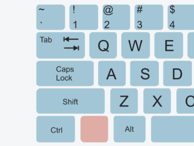

# Lesson #0 - Setting up your workspace

And so it begins...

Lessons are numbered 1, 2, 3, etc and are intended to be worked through in ascending order, without
    skipping any. 
If you think 'I already know this', don't skip the lesson as there are valuable tips dotted
    through the text.

Every lesson begins with a set of objectives which will all be completed during the lesson.
We'll refer back to these at checkpoints throughout the lesson, but feel free to tick them off
    yourself as we go with the checkboxes provided!

In fact, you can tick the first objective off now!

## ✔️  Objectives
- To learn the format of lessons in *Codename: TEABAG*
- To learn about hazards
- To learn correct typing
- To install the tools needed for later lessons
- To learn how to get help

## In This Lesson
- [Typing (Shift vs. Caps Lock)](#-typing-shift-vs-caps-lock)
- [Alerts](#-alerts)
- [Installing VSCode](#-installing-vscode)
- [Installing Python](#-installing-python)

---

## 🔼 Typing (Shift vs. Caps Lock)

Some people don't know that the *Caps Lock* and *Shift* keys on your keyboard do different things:



```
The 'Caps Lock' key TURNS CAPITALS ON UNTIL YOU press it again.
 Caps-Lock pressed ^             Pressed again ^


The 'Shift' key TURNS ON CApitals while you HOLD IT DOWN.
                ^--shift--^^---no shift---^^---shift---^
```

When programming, you'll do a lot of typing.
I highly recommend teaching yourself to use *Shift* because:
- You'll need to press it anyway because of symbols like `= + - _ % ^ &`
- Why would you want to spam *Caps Lock* twice?

```
Some people type Single Capital Letters using Caps Lock...
^                ^      ^       ^             ^    ^
  Press Caps Lock, then the letter, then Caps Lock again.


... but people who Type a Lot know that Shift Works Better.
                   ^      ^             ^     ^     ^
  Hold Shift while typing the letter.
```

There are probably two *Shift* keys on your keyboard (left and right).
Take a moment to find them - they're probably marked with *'Shift'* or an *upwards arrow ⬆️*.

Don't use *Caps Lock*. 
Please just hold *Shift*...
Please.

---

## 🚨 Alerts

Throughout each lesson, there will be items that I want to draw your attention to, which I'll
    do through *alerts*.

| Alert | Purpose | 
| --------------- | --------------- |
| ⚒️ Task | To make you work, *mwa ha ha haaa*... |
| ⚠️ Hazard | To warn you about a potential pitfall! |
| ⚡Tip | To give helpful advice. |
| ⏰ Break | To remind you to take breaks. |

In the text, an alert will look a bit like this!
Be sure to read them, as absorbing their wisdom may save you a lot of pain!

| ⚠️ Hazard ⚠️ |
| ------------- |
| Woah, there! Watch where you're going! |

---

## 🐍 Installing Python
### 🤔 Why Python?
### The limitations of the IDLE
## 📺 Installing VSCode
### 🤔 Why VSCode?


## What is 'Syntax'
Like human languages, programming languages have rules which a programmer must follow for the computer to
    be able to 

In the same way, computers need the 'recipes' humans write to follow the rules of the programming
    language that is being used.
Think of it like baking a cake: 
a baker (programmer) writes a recipe (program) so that their friend (the computer) can bake a cake 
    (perform some useful task).
If the baker's friend is very [pedantic](https://dictionary.cambridge.org/dictionary/english/pedantic) 
    (like a computer), they won't know how to follow the recipe if the baker makes a spelling error.

## Big scary errors
Error messages are there to help you, but sometimes they're not very good at it.
Either way, always read them because they give you important information!
