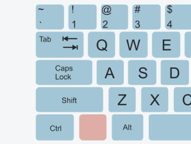
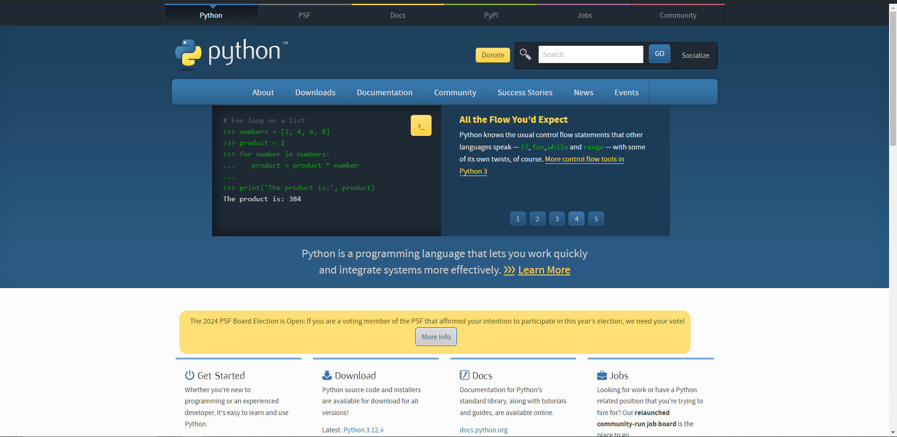
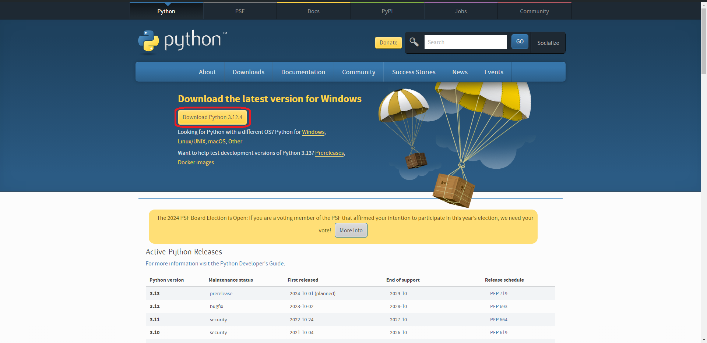
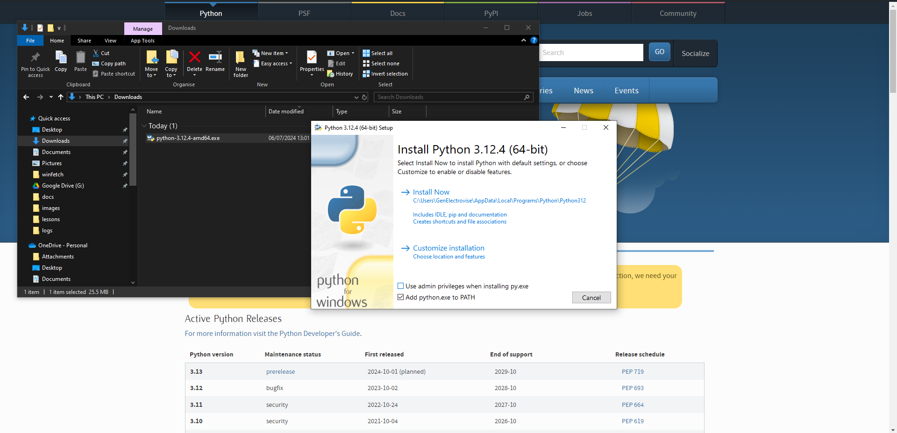

# Lesson #0 - Setting up your workspace

And so it begins...

Lessons are numbered 1, 2, 3, etc and are intended to be worked through in ascending order, without
    skipping any. 
If you think 'I already know this', don't skip the lesson as there are valuable tips dotted
    through the text.

Every lesson begins with a set of objectives which will all be completed during the lesson.
We'll refer back to these at checkpoints throughout the lesson, but feel free to tick them off
    yourself as we go with the checkboxes provided!

In fact, you can tick the first objective off now!

## ✔️  Objectives
- To learn the format of lessons in *Codename: TEABAG*
- To learn about hazards
- To learn correct typing
- To install the tools needed for later lessons
- To learn how to get help

## In This Lesson
- [How does a computer work?](#-how-does-a-computer-work)
- [How to type properly](#-how-to-type-properly)
- [Alerts](#-alerts)
- [Installing VSCode](#-installing-vscode)
- [Installing Python](#-installing-python)

---

## 🖥️ How does a computer work?

Contrary to popular belief, computers are not controlled by tiny electrical gnomes[^1].
Because they're made of rocks, they also literally have the intelligence of... a rock.

[^1]: Citation needed.

The reason they look 'intelligent' is that they're just *really fast* at executing simple instructions 
    called 'machine-code'.
All machine code does is tell the computer how to move around data inside of it.
Unfortunately, machine code makes no sense to humans:

```
010101000100010101000001010000100100000101000111
```

If that *does* in fact make sense to you, you're definitely some kind of demigod and certainly don't need me.

Fortunately for normal human beings, we have programming languages.
All programming languages are is a way for humans to tell a computer how to move numbers inside of it.

Zero gnomes involved.

## 🔼 How to type properly

*If you already use the Shift key[^2] to type capitals, skip this section.*

[^2]: Preferably you don't [press shift with your thumb](https://youtube.com/shorts/c9r7FSmEEno?si=zut9bZcDSsehlPfM)

Some people don't know that the *Caps Lock* and *Shift* keys on your keyboard do different things:



```
The 'Caps Lock' key TURNS CAPITALS ON UNTIL YOU press it again.
 Caps-Lock pressed ^             Pressed again ^


The 'Shift' key TURNS ON CApitals while you HOLD IT DOWN.
                ^--shift--^^---no shift---^^---shift---^
```

When programming, you'll do a lot of typing.
I *highly* recommend teaching yourself to use *Shift* because:
- You'll need to press it anyway because of symbols like `= + - _ % ^ &`
- Why would you want to spam *Caps Lock* twice?

```
Some people type Single Capital Letters using Caps Lock...
^                ^      ^       ^             ^    ^
  Press Caps Lock, then the letter, then Caps Lock again.


... but people who Type a Lot know that Shift Works Better.
                   ^      ^             ^     ^     ^
  Hold Shift while typing the letter.
```

There are probably two *Shift* keys on your keyboard (left and right).
Take a moment to find them - they're probably marked with *'Shift'* or an *upwards arrow ⬆️*.

Don't use *Caps Lock*. 
Just hold *Shift*...
You ***will*** thank me later.

---

## 🚨 Alerts

In lessons, when I want to draw your attention to something, I'll use one of these *alerts*:

| Alert | Purpose | 
| --------------- | --------------- |
| ⚒️  Task | To make you work, *mwa ha ha haaa*... |
| ⚠️ Hazard | To warn you about a potential pitfall! |
| ⚡Tip | To give helpful advice. |
| 🚩 Checkpoint | For when you've completed something cool! |

...which will look a bit like this:

| ⚠️ Hazard ⚠️ |
| ------------- |
| Woah, there! Watch where you're going! |

Be sure to read them, as absorbing their wisdom may save you a lot of pain!

---

## 🐍 Installing Python

In this guide, we'll use Python because it's got a friendly syntax for beginners and the tools to get started
    are easy to set up.

| ⚒️  Task ⚒️  |
| ------------- |
| Here's your first task! Find the Python programming language website - perhaps try searching *'Python programming language'*. If you get stuck or want to check your answers, expand the box below. |

<details>
    The website you want is: https://www.python.org/
</details>

When you get there, you'll find something like this:



You'll then need to navigate to the `Downloads` page and download the Python installer.
The Python webiste is smart and puts the latest version for your operating system at the top of the page:



Save the installer and double-click to run it, and you'll be greeted with this window.
- *Uncheck* `Use admin privileges` unless you know your computer's admin password.
    This option tells the installer whether or not to install Python for *all* users on your computer.
- *Check* `Add python.exe to PATH`. This will let us run Python from anywhere on your computer later.



### The limitations of the IDLE
## 📺 Installing VSCode
### Configuring Python
### Configuring Black


---
---
---
---
---
---
---


## What is 'Syntax'
Like human languages, programming languages have rules which a programmer must follow for the computer to
    be able to 

In the same way, computers need the 'recipes' humans write to follow the rules of the programming
    language that is being used.
Think of it like baking a cake: 
a baker (programmer) writes a recipe (program) so that their friend (the computer) can bake a cake 
    (perform some useful task).
If the baker's friend is very [pedantic](https://dictionary.cambridge.org/dictionary/english/pedantic) 
    (like a computer), they won't know how to follow the recipe if the baker makes a spelling error.

## Big scary errors
Error messages are there to help you, but sometimes they're not very good at it.
Either way, always read them because they give you important information!


---

## 🤔 What, Why and How

### What is programming?
It may seem like a silly question in a programming tutorial, but it's work asking!

> To Program: Provide (a computer or other machine) with coded instructions for the automatic 
> performance of a task. (Oxford Languages)

Or, in simpler terms, you tell a computer the steps it needs to do some helpful task.
    
Computers are not intelligent - they're just very fast at executing simple instructions called "machine-code",
Machine-code just tells the computer where to move data from and to inside itself, and it's hard to 
    write because it's all binary, like so:

```
010101000100010101000001010000100100000101000111
```

If that makes any sense to you, you're definitely some kind of demigod and certainly don't need me.

But if you're a normal human being, a "programming language" may be helpful.
Programming languages give humans an easier way to instruct the computer in its task, and they come in
    all shapes and sizes.
Together, these instructions form a "program" which can be translated into the machine-code that the computer
    so desperately craves.


### Why learn programming?

Maybe you're learning because you need it for your education or job.
Perhaps you have some grand project you want to make - the game to end all games?
Some people just want to try it out. All of these are valid reasons to want to learn.

I learned because I wanted to 
    [modify the game *Minecraft*](https://github.com/atom-dispencer/MagiksMostEvile/tree/1.7.10/)
    (I warn you, my old code is dreadful) but I kept going because it lets me make whatever I want.
Given some time and commitment I can create games, helpful tools for myself, or even a [computer inside
    a computer](https://github.com/atom-dispencer/iAtomSys).


### How do I learn to program?
You learn to program the same as any other skill - the piano, perhaps?

To learn an instrument, you'll do some reading and learn some theory, but practise is key!
Any musician will tell you that "theory can only take you so far", which is why this guide will make you 
    sweat a little... (***"I will not copy-paste... I will not copy-paste..."***).
If any mistakes come up (and I'll make sure they will 😉), I encourage you to explore what went wrong so 
    we can learn from and (hopefully) enjoy the experience.

---
