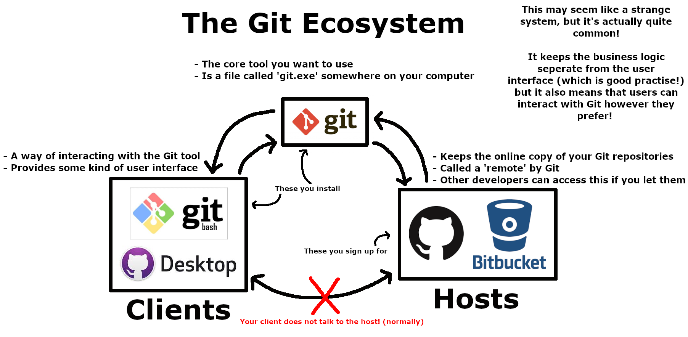

# Git

*To all the Git nerds out there, I'm going to simplify a bit.
I *do* know how it actually works. Don't shout at me.*

This guide will introduce you to the basics of Git - what it is, why you should use it, and how it works.
There'll be a little bit of technical information, but any key concepts are explained.
Keywords marked in **bold** are explained in the [Terminology](#Terminology) section.

## Contents:
- [What is Git?](#what-is-git)
- [Why does anyone use Git?](#why-does-anyone-use-git)
- [Why do I need Git if I'm working alone?](#why-do-i-need-git-if-im-working-alone)
- [But Git's annoying to use!](#but-gits-annoying-to-use)
- [How to use Git (the basics)](#how-to-use-git-the-basics)

## What is Git?
Git is a tool for managing and synchronising edits within a codebase.

Git and GitHub are not the same!

When you use Git, there are several pieces in play:
- Git itself *(just a program that runs on a computer)*
- A Git client *(that lets you interact with Git, for example the Git integration in MATLAB)*
- Whoever is hosting your **remote Git repository**
*(lots of scary words, but that's normally just GitHub)*

Confused? Here's a picture!



## Why does anyone use Git?
One of the main use cases for Git is when working in a team.
When programming professionally, you will often work in teams, which means that many developers will be making changes to the same code.

Before version control tools (Git was not the first!), programmers had to merge changes manually, which takes a long time and is prone to errors.

## Why do I need Git if I'm working alone?
First, it's practise for later.
If you aren't used to using a tool now, you won't use it effectively when it's important later!

Second, Git does more than just 'save a copy' of your code.
It saves *incremental* changes so that you can easily fix problems later: should you encounter a problem, you can easily revert your changes, *regardless of whether you remembered to make a backup*.

## But Git's annoying to use!
Git isn't perfect, but there's a reason it's the industry standard!

If Git is causing major problems, it probably means that you either have an irritating Git *client*, or you're using it wrong.

The Git integration in, for example, MATLAB is terrible (plus it means you can only use Git in that application) so you should get a different Git client.

A good client is [GitHub Desktop](https://desktop.github.com/). If you know the basic Git [Terminology](#Terminology), it's simple to use (just point and click!) and works seamlessly with **repositories** hosted on GitHub.

## How to use Git (the basics)

### Terminology
Here are a few words that you'll need to know to understand the next section.

#### Repository
All of your code with a folder called **.git**.
The Git tool manages all the data in **.git**, so you can look at stuff in there, but don't touch it!

A repository can be **local** or **remote** (explained below)

#### Local/Remote

**Local** refers to the machine you are reading this on (or whatever other device you're using Git on!).
Whenever you make and **commit** changes to your code, that is done in the **local repository**.

**Remote** refers to wherever the 'backup' of your repository is, be that GitHub, BitBucket or some other web service.
Whenever you want to make a 'backup' of your code or work with teammates, you have to interact with the **remote repository**.

The **remote repository** stores the same information as the **local repository**, it's just in a place where multiple people can access it.

A **local repository** does not have a **remote repository** set up by default and can operate happily without one, but you won't be able to share your code with teammates.
**Git clients** help you to point Git to a **remote repository** that it can use.

#### Commit
It's important to understand that Git does *not* save your files themselves, but instead a **delta** of each file.

A **commit** is just a collection of **deltas**.

These **deltas** tell Git how lines in your file have been *edited*. For example:
```matlab
a = arduino()
writeDigitalPin(a, 'D0', 1)
```
...now if I want to change `'D0'` to `'D1'`...
```matlab
a = arduino()
writeDigitalPin(a, 'D1', 1)
```
The **delta** that Git will store looks something like:
```matlab
- writeDigitalPin(a, 'D0', 1)
+ writeDigitalPin(a, 'D1', 1)
```
See that Git has not stored the whole file, just the lines that have been changed!
This saves loads of space!
How neat!


---
### Commands
Git is a large and powerful tool, but most people only need a few commands.
If you're using a GUI, such as in GitHub Desktop, these are all done with just a click!
- Clone
- Fetch
- Commit
- Push
- Pull

The names may seem daunting, but you'll find they match up well with the tasks they perform!

#### Clone
Creates a *new* **local repository** on your computer by copying the **.git** folder from the **remote repository**, then creates all of the repository's code files as well.
Only used when you interact with a **remote repository** for the first time.

#### Fetch
Updates the **.git** folder in the **local repository** with changes from the **remote repository**.
Used when you already have a **local** and **remote** repository and you want to sync them.

#### Commit
Create a **commit** in the **local repository**. Used when you have changes that are worth saving.

#### Push
Copy all the new **commits** in the **local repository** to the **remote repository**. Used when you want to share commits with the **remote repository** to do a 'backup' and make them available for teammates.

#### Pull
Opposite of **push**.
Copy all the new **commits** from the **remote** to the **local repository**.
Used when your teammates have **pushed** changes to the **remote repository** and you want them in your **local repository**.

---
*Copyright (C) 2024 Adam Spencer. Licensed under GNU GPL-3.0 and hosted at https://github.com/atom-dispencer/CodenameTeabag. Please refer to the COPYING file distributed in the root of this repository. Git, Git Bash, GitHub, GitHub Desktop and BitBucket are the property of their respective owners, with whom the author is not associated.*
